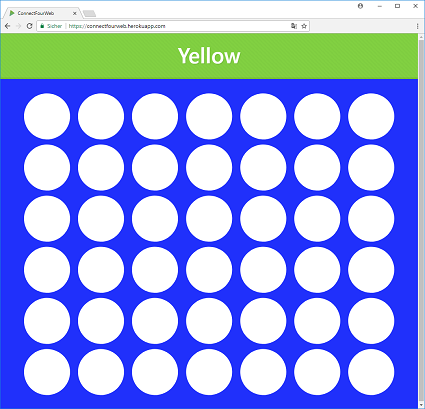
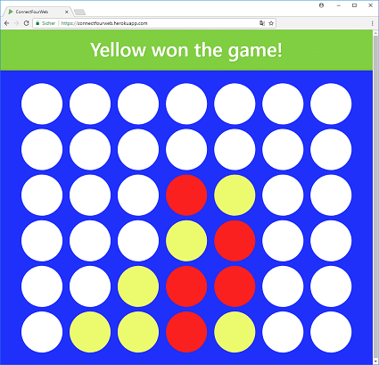

ConnectFourWeb
=====================================
ConnectFourWeb is a web implementation of the game Connect Four.

See also: https://en.wikipedia.org/wiki/Connect_Four.

[](https://travis-ci.org/danielfranze/ConnectFourWeb) [](https://coveralls.io/github/danielfranze/ConnectFourWeb?branch=master) [](https://codecov.io/gh/danielfranze/ConnectFourWeb)
 [](https://www.codacy.com/app/danielfranze/ConnectFourWeb?utm_source=github.com&utm_medium=referral&utm_content=danielfranze/ConnectFourWeb&utm_campaign=Badge_Coverage)  [](https://www.codacy.com/app/danielfranze/ConnectFourWeb?utm_source=github.com&amp;utm_medium=referral&amp;utm_content=danielfranze/ConnectFourWeb&amp;utm_campaign=Badge_Grade)

Preview
--------------------

Start Screen                       |  Winner Screen
:----------------------------------:|:---------------------------------:
  |  

Live Demo
--------------------
https://connectfourweb.herokuapp.com/

Installation
--------------------

1. Clone this Repository
2. Open it with IntelliJ IDEA (with Scala plugin)
3. Change in "public\javascripts\app.js" the line 5 (for local usage):
```javascript
var scheme   = "ws://";
```
* local mode: "ws://"
* production mode: "wss://"

4. Start Play

Technologies
----------------------

  

License
-------
ConnectFourWeb is released under the terms of the MIT license. See https://opensource.org/licenses/MIT for more information.
